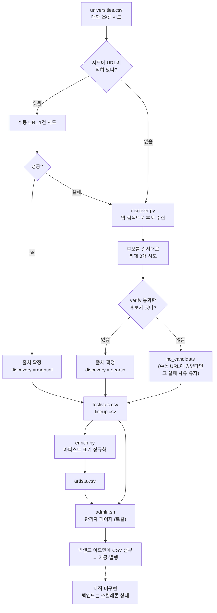
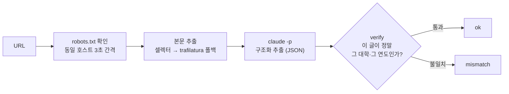
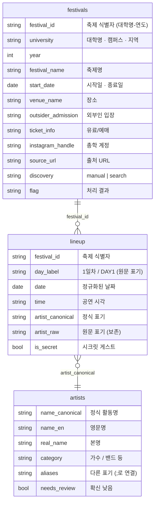
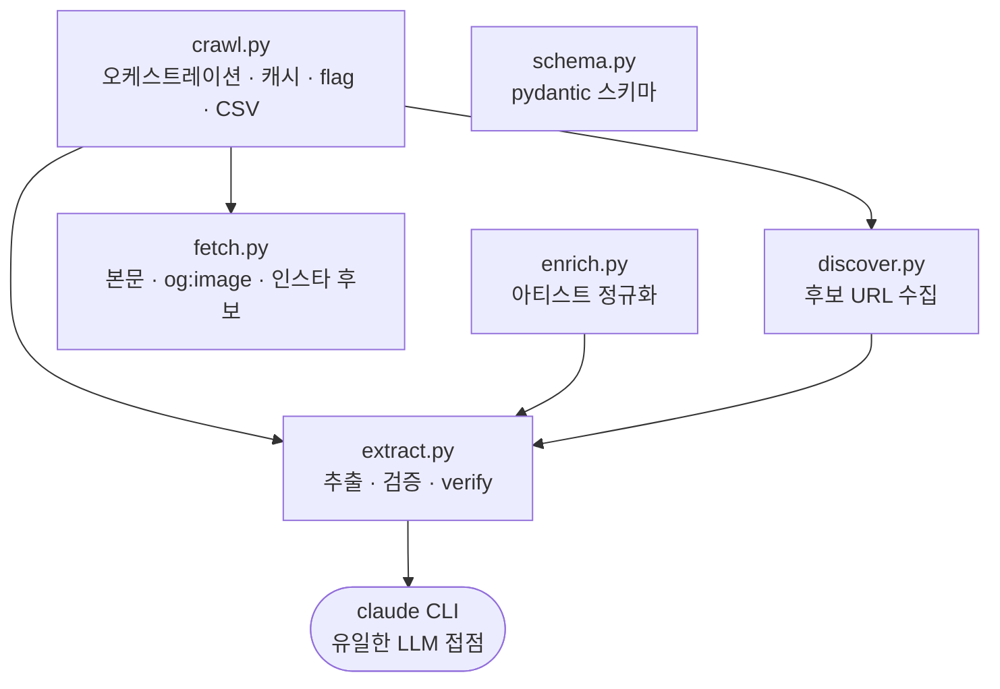

# FESTA 크롤러

대학 축제 정보(축제 상세 + 라인업)를 웹에서 수집·추출해 사람이 검토할 CSV로 만드는 로컬 배치
크롤러다. 출처는 손으로 넣은 URL을 우선하고, 없거나 실패한 대학은 검색으로 후보를 찾는다.
설계 근거는 [`2026-08-04-crawler-pipeline-design.md`](./2026-08-04-crawler-pipeline-design.md) 참고.

**크롤러는 초안 생성기다.** 최종 신뢰는 사람이 담보한다 — CSV를 검토하는 단계가 곧 검수
큐다. 크롤러를 돌리고 그 결과를 검수하는 조작판이 [관리자 페이지](#관리자-페이지)(`./admin.sh`)이고, 검토를 마친
CSV는 백엔드 어드민에 첨부해 가공·발행한다.

## 파이프라인



크롤러의 책임은 **검토를 마친 CSV까지**다. 그 뒤 적재·가공·발행은 백엔드 어드민 소관이며,
현재 백엔드에는 해당 기능이 없다 — 지금은 CSV가 최종 산출물이다.

**URL 1건을 처리하는 과정**은 출처가 수동이든 검색이든 동일하다.



마지막 `verify` 단계가 검색 탐색의 안전장치다. LLM이 URL을 지어내도 열리지 않으면 탈락하고,
엉뚱한 대학 글이면 `mismatch`로 걸러진다. 그래서 검색이 지저분한 후보를 주더라도 잘못된
출처가 채택될 여지가 작다.

## 정보 구조

산출물은 CSV 3종이다. `output/`에 생성되며 git에 커밋하지 않는다.



`artist_raw`는 원문 표기를 그대로 보존하고 `artist_canonical`이 정규화된 이름을 담는다
(`십센치` → `10CM`). 원문을 남겨두는 이유는 검수할 때 출처와 대조할 수 있어야 하기 때문이다.

## 모듈 구조



| 파일 | 하는 일 | LLM 호출 |
|---|---|---|
| `crawl.py` | 시드 순회, 출처 결정, 캐시 판정, flag 부여, CSV 출력 | 없음 |
| `discover.py` | 웹 검색으로 후보 URL 수집. **판단하지 않는다** | 탐색 1콜 (도구 ON) |
| `fetch.py` | robots·간격 준수 수집, 본문·`og:image`·인스타 후보 채집 | 없음 |
| `extract.py` | 구조화 추출, 역방향 검증(`verify`), `call_claude` | 추출 1콜 (도구 OFF) |
| `enrich.py` | 아티스트 표기 정규화, 마스터 생성 | 후처리 1콜 (도구 OFF) |
| `schema.py` | pydantic 스키마 | 없음 |

`claude` CLI 호출은 전부 `extract.call_claude` 하나를 지난다. 나중에 API로 옮길 때 그 함수
내부만 바꾸면 된다. **웹 검색 도구는 탐색 호출에서만 켜고**, 신뢰할 수 없는 블로그 본문을
읽는 추출·정규화 호출에서는 모든 도구를 차단한다.

## 설치

```bash
python3 -m venv .venv && .venv/bin/pip install -r requirements.txt
```

수집·추출·탐색 모두 로컬 Claude Code CLI(`claude`)를 헤드리스로 호출한다 — 실행 전 `claude`
로그인이 되어 있어야 한다. 별도의 API 키는 필요 없다.

## 실행

```bash
./admin.sh          # 관리자 페이지 — venv가 없으면 만들고 띄운다
```

**이거 하나면 된다.** 수집·정규화·검수가 전부 그 화면 안에서 끝난다 — `crawl`·`enrich` 전체
실행도, 특정 대학만 다시 돌리는 것도 버튼이다 ([관리자 페이지](#관리자-페이지) 참고).
어느 디렉터리에서 실행해도 되고, 인자는 그대로 넘어간다 (`./admin.sh --port 8790`).

터미널에서 직접 부를 수도 있다. 화면 없이 배치로 돌리거나 `--limit`으로 스모크할 때 쓴다.

```bash
.venv/bin/python crawl.py [--limit N]   # --limit: 앞에서 N행만 처리 (스모크용)
.venv/bin/python enrich.py              # crawl 완료 후 실행
.venv/bin/python serve.py               # admin.sh 없이 서버만 직접 띄울 때
```

`crawl.py`가 `output/festivals.csv`·`output/lineup.csv`를, `enrich.py`가 `output/artists.csv`를
만든다. 화면의 버튼이 실행하는 것도 정확히 이 두 명령이다.

**스키마 변경 시 재생성.** `festival_id` 컬럼 도입(#9) 이전에 만든 `output/`가 남아 있다면
새 스키마와 맞지 않는다 — `crawl.py`를 한 번 다시 실행해 재생성한다. `output/raw/*.json`
캐시가 남아 있으면 캐시 히트만 일어나 LLM 호출 없이 빠르게 끝난다.

**소요 시간.** 캐시가 빈 상태에서 29곳 전체를 돌면 30~50분 걸린다. 대부분이 LLM 호출 대기
시간이고, 특히 검색 탐색은 1건에 60초 이상이다. 중간에 끊겨도 캐시가 남으니 같은 명령으로
다시 실행하면 이어서 처리한다.

## 관리자 페이지

`./admin.sh`로 띄우는 로컬 화면(`serve.py` + `review.html`)이다. 크롤러를 돌리고 그 결과를
검수하는 조작판이며, 크롤러를 쓰는 정상 경로다.

**값을 고치는 기능은 없다.** 화면이 하는 일은 "무엇이 잘못됐는지 찾아내고 다시 돌리는 것"
까지고, 값 교정은 백엔드 어드민에 CSV를 첨부하는 단계에서 처리한다.

```
┌────────────────────────────────────────────────────────┐
│ [전체 크롤] [enrich]   ● 대기 중        로그 ▾          │
├──────────────────────┬─────────────────────────────────┤
│ [문제만] [검색출처]   │ 건국대학교-2026                  │
│ [전체]  [아티스트]    │  [다시 돌리기] [탐색부터]        │
│                      │  축제명 / 기간 / 장소 / 외부인   │
│ ● no_candidate 숙명   │  티켓 / 인스타 / 포스터 / 출처   │
│ ● no_candidate 동덕   ├─────────────────────────────────┤
│ ○ ok      건국       │ 라인업 8건                       │
│ ○ ok      고려       │  10CM ← 십센치   1일차 19:00    │
│ ...                  ├─────────────────────────────────┤
│                      │ 원본 (iframe)   [새 탭 ↗]        │
└──────────────────────┴─────────────────────────────────┘
```

**할 수 있는 것**

| | |
| --- | --- |
| 필터 `문제만` | `flag != ok` 행만. 진입 시 기본값 — 사람이 볼 것부터 보여준다 |
| 필터 `검색출처` | `discovery = search` 행만. 손으로 고른 출처가 아니라 우선 확인 대상이다 |
| 필터 `전체` | 축제 29곳 전부 |
| 탭 `아티스트` | `artists.csv`를 `needs_review` 우선으로 정렬해 표시 (정렬만, 필터 아님) |
| 상세 보기 | 축제 필드 전체 + 그 축제의 라인업. `artist_canonical ← artist_raw`로 정규화 전후를 나란히 |
| 원본 대조 | `source_url`을 iframe으로 임베드. 막는 사이트가 많아 `새 탭 ↗`이 실질적 주경로다 |
| 버튼 `전체 크롤` | `crawl.py` 전체 실행 (캐시 비면 30~50분) |
| 버튼 `enrich` | `enrich.py` 실행 |
| 버튼 `다시 돌리기` | 그 대학의 `raw/` 캐시만 지우고 재실행. `mismatch`·`empty_body`처럼 출처는 맞고 추출이 틀린 행에 |
| 버튼 `탐색부터` | `raw/`+`discovered/`를 지우고 재실행. `no_candidate`처럼 후보 목록 자체가 쓸모없던 행에 |
| 로그 | 실행 중인 잡의 stdout을 1초 간격으로 흘려보낸다. 끝나면 상태가 바뀌고 목록이 자동 갱신된다 |
| 키보드 | `j`/`k`로 목록 이동 |

**행 단위 재실행이 전체 실행인 이유.** `crawl.py`에 "한 곳만" 옵션이 없다. 대신 그 대학의
캐시 파일을 지우고 `crawl.py`를 통째로 돌린다 — 나머지 28곳은 캐시 히트로 즉시 지나가고,
CSV 재생성까지 따라온다.

**제약**

- `127.0.0.1`에만 바인드한다. 외부에 열지 않는다
- 잡은 한 번에 하나만 돈다. 실행 중에 또 누르면 "이미 실행 중입니다" — `crawl`과 `enrich`가
  같은 Claude 구독 세션 한도를 쓰기 때문에 둘을 동시에 띄우면 양쪽이 깨진다
- 재실행 대상 대학명은 `universities.csv`에 실재하는 값만 받는다
- 원본 임베드·링크는 `http(s)` URL만 연다

## 대학 시드 (`universities.csv`)

| 컬럼 | 내용 |
|---|---|
| `university` `campus` `region` | 대학 정보. CSV에만 있고 크롤링하지 않는다 |
| `year` | 수집 대상 연도 |
| `url` | 알고 있는 출처 URL. **비워도 된다** — 비면 검색으로 찾는다 |

나무위키는 라이선스(비영리) 문제로, 검색 엔진 결과 페이지는 `robots.txt` 차단 때문에 검색
후보에서 제외한다.

## flag 의미

`festivals.csv`의 `flag` 컬럼:

| flag | 의미 |
|---|---|
| `ok` | 수집·추출·검증 모두 성공 |
| `fetch_failed` | 본문 수집 실패 (네트워크 오류, robots.txt 차단 등) |
| `empty_body` | 본문이 100자 미만 (포스터 이미지만 있는 글 등) |
| `extract_failed` | LLM 추출이 2회 시도 후에도 유효한 JSON을 내지 못함 |
| `mismatch` | 추출은 됐지만 결과가 요청한 대학·연도 글이 아닌 것으로 판정 |
| `no_candidate` | 검색까지 했으나 쓸 만한 후보를 찾지 못함 |
| `no_source` | 출처를 확보하지 못한 그 밖의 경우 |

손으로 넣은 URL이 실패하고 검색도 실패하면 **`no_candidate`가 아니라 그 URL의 실패 사유가
남는다** (`fetch_failed` 등). URL이 깨졌다는 정보가 더 쓸모 있기 때문이다.

`flag != ok` 행은 운영자가 `source_url`을 직접 열어 확인한다.

## 캐시 동작

캐시는 두 종류다.

**수집·추출 결과** — `output/raw/<대학명>.json`. `universities.csv`의 **`url`과 `year`가
그대로면** 캐시를 반환하고 재수집하지 않는다. 둘 중 하나라도 바뀌면 캐시를 무시하고 다시
처리한다. 검색으로 찾은 URL이 아니라 **시드에 적힌 URL**이 판정 기준이라, 검색으로 채운
대학도 시드가 그대로면 재실행 때 검색을 반복하지 않는다.

**검색 후보 목록** — `output/discovered/<대학명>.json`. 연도가 같으면 재사용한다. 검색 1건이
60초 이상 걸리기 때문에 이 캐시가 없으면 재실행 비용이 크다.

- **강제 재수집하려면** 해당 대학의 `output/raw/<대학명>.json`을 지우고 다시 실행한다.
  검색까지 다시 하려면 `output/discovered/<대학명>.json`도 함께 지운다.
- `fetch_failed`와 `extract_failed`는 캐시에 저장되지 않는다 — 네트워크 오류나 LLM 호출 실패
  같은 일시적 문제를 영구히 굳히지 않기 위함이다. `empty_body`·`mismatch`·성공 결과는 캐시된다.

## 운영 팁

- Claude 구독 세션 한도에 걸리면 크롤러가 중단된다. 한도가 리셋된 뒤 같은 명령으로 재실행하면
  이미 처리된 대학은 캐시로 건너뛰고 나머지만 이어서 처리한다.
- `enrich.py`는 전체 아티스트 목록을 한 번에 정규화하는 대형 LLM 호출 1건이라 수 분(최대
  15분 타임아웃) 걸릴 수 있다.
- 검색으로 채워진 행(`discovery=search`)은 손으로 고른 출처가 아니므로 **검수 때 우선 확인한다.**
  대학 공식 홈페이지나 학보사가 잡히면 신뢰도가 높고, 커뮤니티·티켓 플랫폼이면 한 번 더 본다.
- 크롤러 산출물은 초안이다. **`./admin.sh`로 검토한 뒤 백엔드 어드민에 CSV를 첨부한다** —
  최종 신뢰는 검수 단계가 담보한다.
